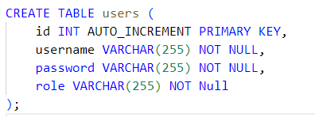

# Cloud-Datenmanagement

## Einführung
Diese Übung zeigt die Anwendung von verteilten Webservices an einer simplen Anforderung.

## Ziele
Das Ziel dieser Übung ist eine Webanbindung zur Benutzeranmeldung umzusetzen. Dabei soll sich ein Benutzer registrieren und am System anmelden können.
Die Kommunikation zwischen Client und Service soll mit Hilfe einer REST Schnittstelle umgesetzt werden.

## Voraussetzungen
 Grundlagen einer höheren Programmiersprache; Verständnis über relationale Datenbanken und dessen Anbindung mittels ODBC oder ORM-Frameworks; Verständnis von Restful Webservices

## Aufgabenstellung
Es ist ein Webservice zu implementieren, welches eine einfache Benutzerverwaltung implementiert. Dabei soll die Webapplikation mit den Endpunkten /auth/admin/register, /auth/signin und /auth/verify erreichbar sein.

## Grundanforderungen
### Registrierung
Diese soll mit einem Namen, einer eMail-Adresse als BenutzerID, einer Liste an Rollen (ADMIN, READER, MODERATOR) und einem Passwort erfolgen. Dabei soll noch auf keine besonderen Sicherheitsmerkmale Wert gelegt werden, jedoch ist das Passwort nicht unverschlüsselt abzulegen. Die Registrierung der Benutzer kann nur durch Administratoren erfolgen. Die Daten sollen in einem geeigneten Datastore (z.B. relationale Datenbank) abgelegt werden.
Beim initialen Start sollen Benutzer aus einem JSON-File geladen werden können. Dabei dürfen die Passwörter auf keinen Fall unverschlüsselt gespeichert sein.

### Login
Der Benutzer soll sich mit seiner ID und seinem Passwort entsprechend einloggen können. Bei einem erfolgreichen Login soll eine entsprechende HTTP-Response zurück geben und ein signiertes JWT mitgeliefert werden, die auch die genehmigten Rollen enthält.

/auth/verify gibt ein 403 UNAUTHORIZEDzurück, wenn das mitgelieferte JWT nicht der Signatur entspricht. Ansonsten wird eine positive Rückmeldung generiert und die Rolle bestätigt.
Verwenden Sie auf jeden Fall ein gängiges Build-Management-Tool (z.B. Gradle). Dabei ist zu beachten, dass ein einfaches Deployment möglich ist (auch Datenbank mit z.B. file-based DBMS). Überprüfen Sie die Funktionalität mit einfachen Methoden, die einfach nachvollziehbar sind und dokumentieren Sie diese (z.B. mit curl Befehlen).

### Umsetzung:
Wir haben einen Docker-Container mit folgender Datenbank erstellt:

